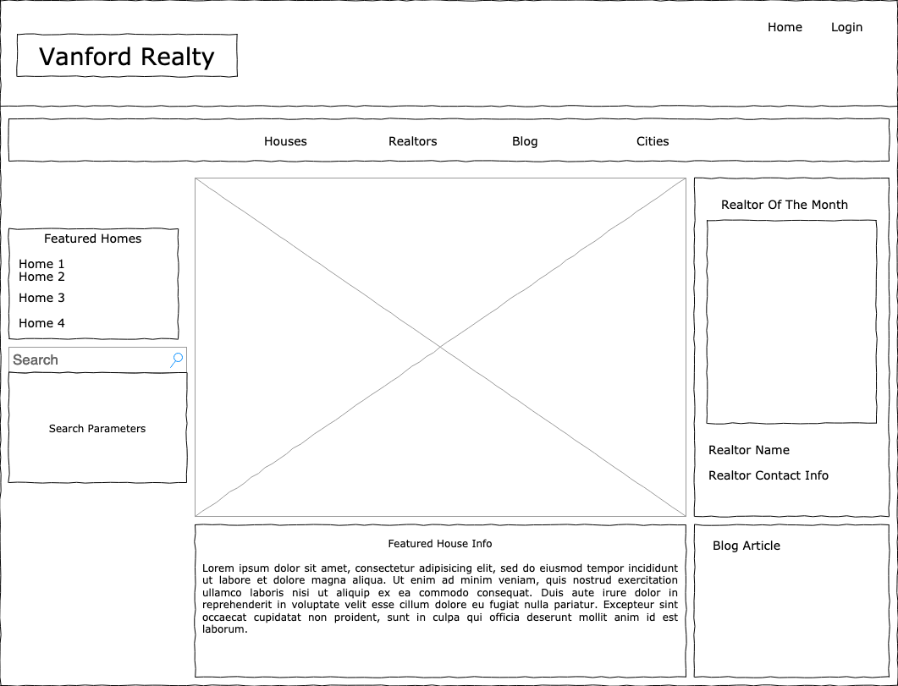
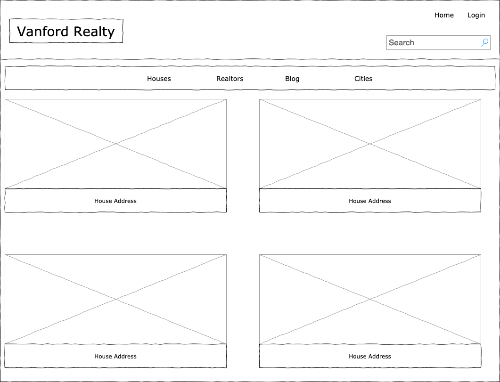
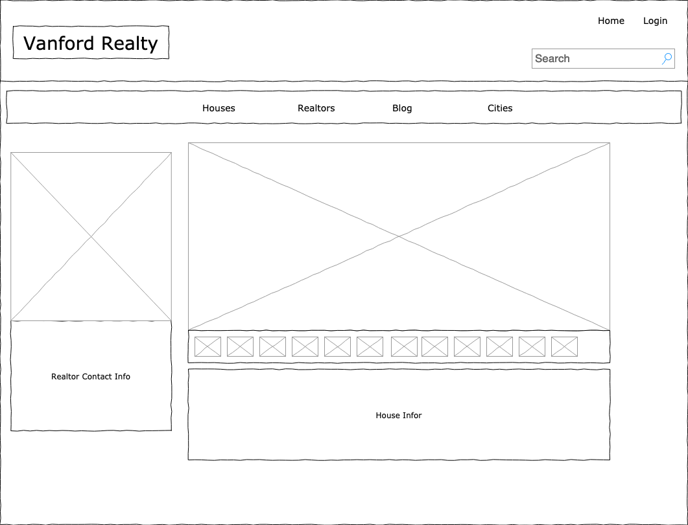
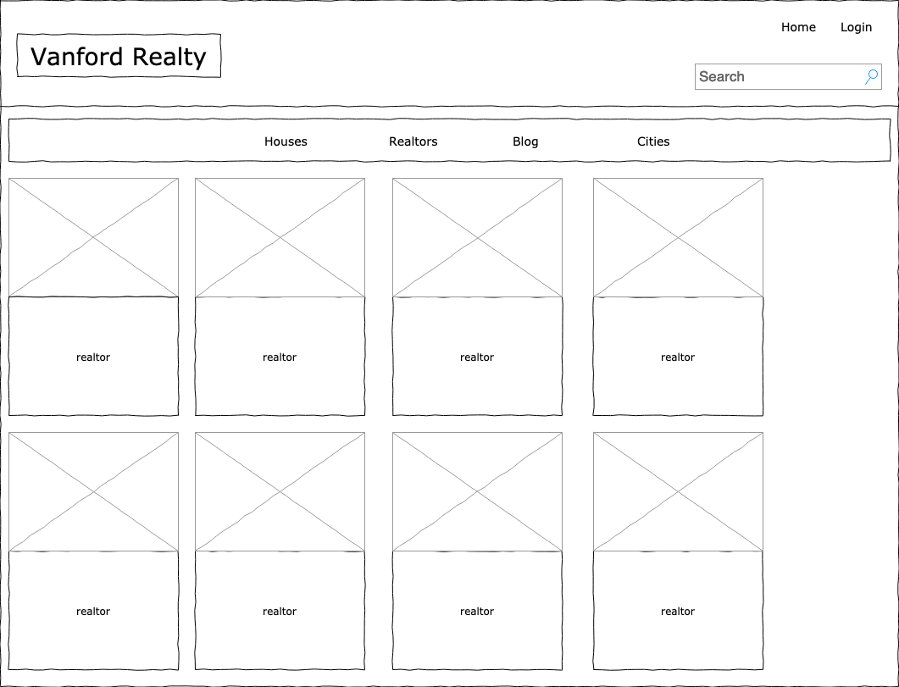
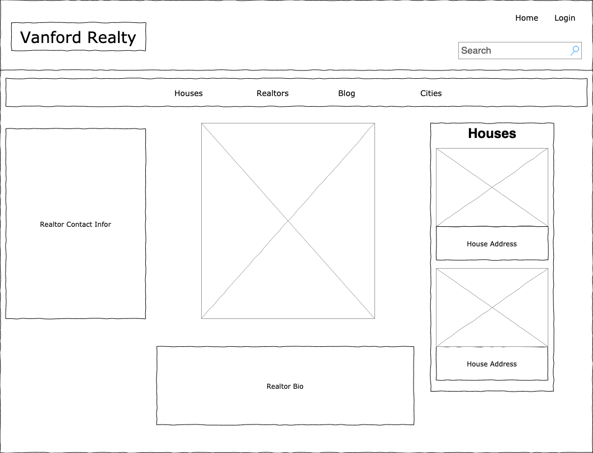
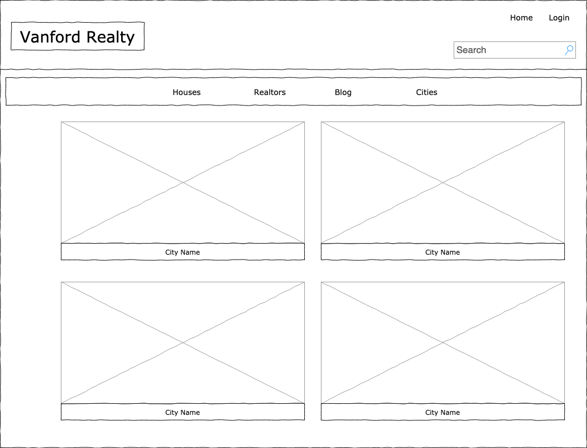
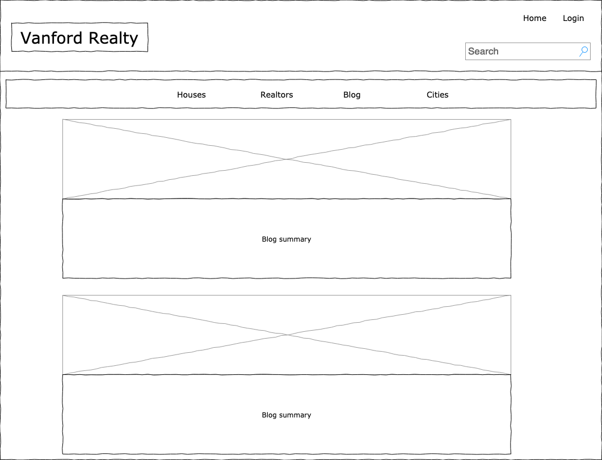
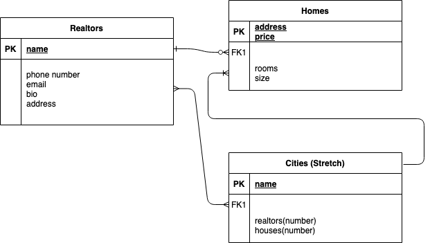

# Vanford Realty
## Who is Vanford Realty?
Vanford Realty is a premier real estate firm located in a major metropolitan area, that serves multiple areas within the region. Vanford realty provides a web application that shows a listing of homes and associated realtors and cities served.  
## User Story
As a realtor, I want a secure web app that provides me the ability to create, update and delete listings in real time. 

As a realtor, I want a web app that allows me to create blog articles that are relevant to my prospective clients in the homebuying process. 

As a realtor, I want to provide an application that provides the prospective home buyer the ability to view a comprehensive listing of houses for sale, along with associated realtors and cities served. Prospective home buyers will be able to find the site and come to a landing page showing a featured home or proceed to additional listing of houses, which the user will be able to click on a house listing to obtain more data, as well as the listing agent.

Additionally, as a realtor, I want to provide the prospective home buyer the ability to search the regions served by Vanford Realty and associated homes in those regions as well as realtors serving those regions. 

## Wireframes

Landing Page - user will see a randomly selected list of featured homes, and a randomly selected realtor of the month.

House Listings - Users will be able to scroll through all existing house listings which link to each house's show page.

House Show- displays house info, images, and the associated realtor.

Realtors page - lists all realtors and links to their show pages.

Realtor Show Page - Each realtor will have their own show page, with their info and house listings.

cities page - shows all the cities the realty company works

blog - displays blog articles written by the realtors

## Data Models

## Milestones
Create Backend (Server)
Create Models/Schemas
Create New, Show, and Edit pages for basic CRUD functionality
Create Landing Page
Create Cities page (3rd Model) - Stretch
Create Realtor portal - Stretch
Create Blog Page - Stretch

## Dependencies Installed
express
body-parser
mongoose
ejs
dotenv
method-override
multer
bcrypt
passport
connect-flash
express-session
passport-local 

## Technologies
Frontend - HTML, CSS, EJS, Bootstrap
Backend - Mongoose, Express, Node
